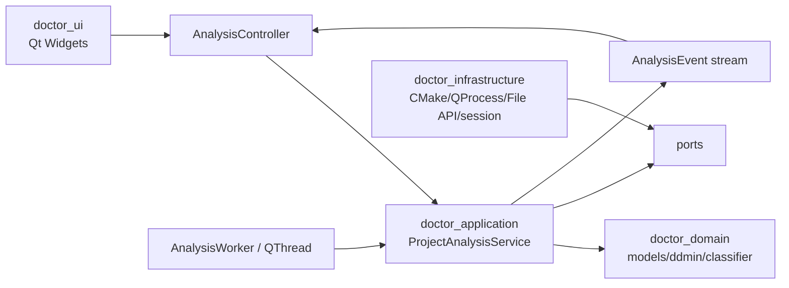
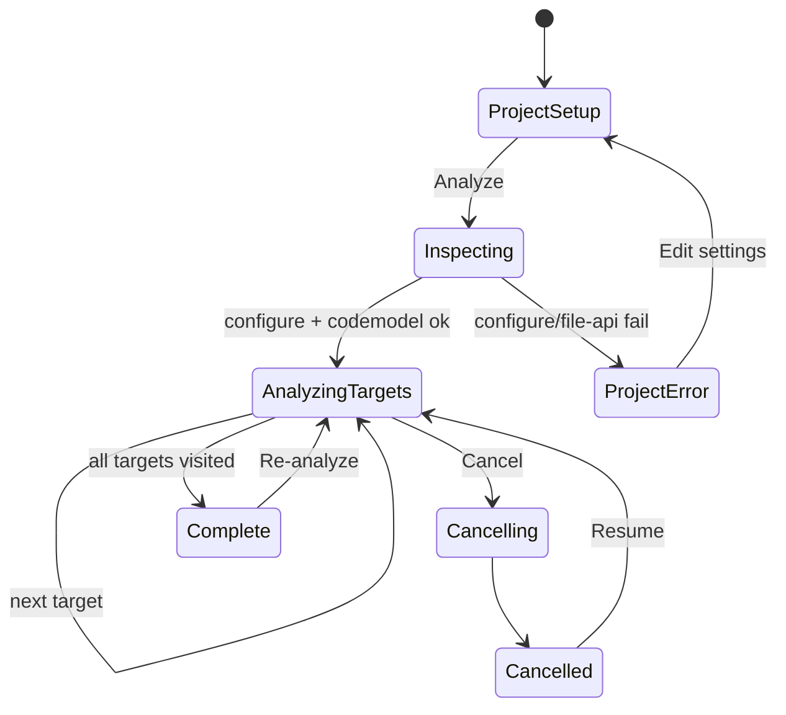
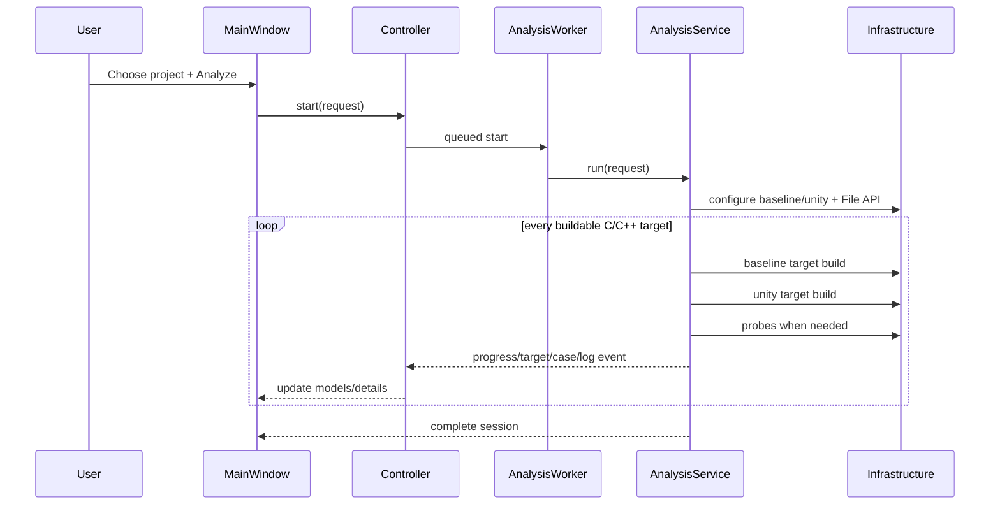
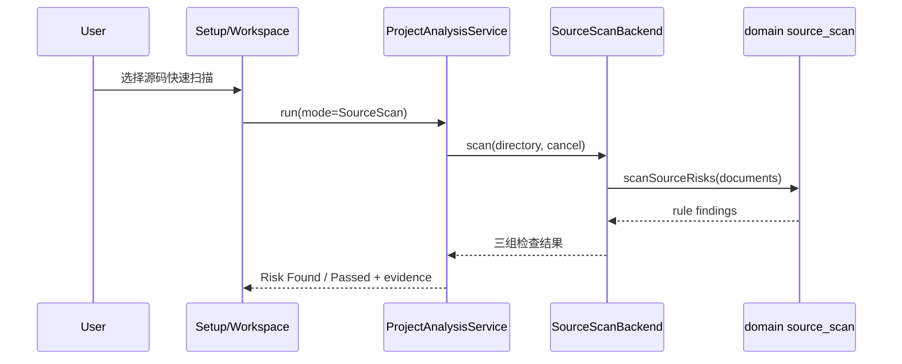

# 设计文档：Unity Build Doctor GUI

> 阶段：design
>
> 工作流：design-first
>
> 设计深度：high
>
> 状态：已起草
>
> 最近更新：2026-07-30

## 设计摘要

- 目标：交付原生 Qt/C++ 桌面应用，让用户选择任意 CMake C/C++ 项目后，在界面中完成全项目 target 发现、普通/Unity 双构建、冲突最小化、问题分类与修复建议查看。
- 覆盖行为：REQ-001–REQ-010。
- 核心方案：Qt 5.15/Qt 6.4 Widgets 共源码原生 `.app`；构建验证由 QProcess/CMake File API/compile database 驱动，源码快速扫描由进程内 C++17 词法规则与只读文件适配器驱动，两种模式共用后台 worker、session 和结果工作台。
- 交付物：`build/bin/UnityBuildDoctor.app` 与 Qt 5/Qt 6 preset build tree 中的自包含应用束；`dist/UnityBuildDoctor.app` 安装/发布目录中的自包含应用束。
- 既有 Python CLI 保留为历史原型和测试思路参考，不是 GUI 的运行时依赖，也不由 GUI 调用。

## 代码库调查

| 证据类型 | 证据 | 已验证事实 | 对设计的影响 |
|---|---|---|---|
| 当前仓库 | `inspect_structure.py` | 已有 Python CLI、21 项测试、8 类 CMake 夹具；没有 C++/Qt 生产代码 | 新增独立 C++ targets；不让 GUI 通过 QProcess 调 Python |
| 用户变更 | “需要有一个界面，可以使用 Qt + C++ 实现……给我一个项目，分析整个项目” | GUI、Qt/C++、全项目分析均为 Must | 废弃 CLI-first 决策，重新定义交互、后台任务和 `.app` |
| Qt 6 Kit | `/Users/qingyizhu/Qt6.4.3/6.4.3/macos/bin/qtpaths --qt-version` | Qt 6.4.3 macOS Kit 可用 | required Qt 6 构建 |
| Qt 5 Kit | `/Users/qingyizhu/Qt5.15.2/bin/qmake -query QT_VERSION` | Qt 5.15.2 macOS arm64 Kit 可用 | required Qt 5 构建 |
| Qt 模块 | `Qt6WidgetsConfig.cmake`、`Qt6TestConfig.cmake` | Widgets 与 Qt Test 可用 | 可实现 Qt Widgets UI 与原生 UI 测试 |
| 部署工具 | `macdeployqt`、`file` | macdeployqt 为 arm64/x86_64 universal，cocoa/offscreen plugins 存在 | 可部署自包含 `.app` 并做 offscreen 测试 |
| 构建工具 | `cmake --version`、`ninja --version` | CMake 3.27.1、Ninja 1.11.1 | 自身使用 CMake/Ninja；目标项目运行时探测自己的 generator/kit |
| 主机 | Apple Clang 17 target triple | macOS arm64 | required 原生交付先锁定 macOS arm64 |
| 应用图标 | 开发包与部署包 `CFBundleIconFile=""`，Resources 无 `.icns` | 当前 bundle 没有应用图标 | `UnityBuildDoctor` target 必须拥有并复制原生图标资源 |
| 分析模式 | `ProjectConfig` 无 mode；`AnalysisWorker` 始终构造 `CMakeBackend`；设置页验证始终要求 CMakeLists/CMake executable | 当前只能构建后分析 | 新增 mode、源码扫描 port/adapter 和条件化 UI 校验 |
| build-tree 交付 | `du -sh out/build/qt6-debug/bin/UnityBuildDoctor.app` 为约 3.3 MiB，且无 `Contents/Frameworks`/`Contents/PlugIns`；`dist/UnityBuildDoctor.app` 为约 92 MiB 并包含上述目录 | 现有普通 build 只生成依赖开发机 Qt 的小型 bundle，完整版仅由额外部署脚本生成 | 将对应 Qt Kit 的 `macdeployqt` 与 ad-hoc 签名接入 app target 的 macOS `POST_BUILD` |

### 工具链与兼容性基线

| 项目 | 已验证值 | 证据 | 设计结论 |
|---|---|---|---|
| GUI Qt | Qt 5.15.2 / Qt 6.4.3 macOS | qtpaths/qmake/Config.cmake | `find_package(QT NAMES Qt6 Qt5)` + requested-major gate |
| C++ | Apple Clang 17，C++17 | `clang++ --version` | 核心使用 C++17，不引入额外第三方库 |
| 目标项目 | CMake C/C++，Qt 版本未知 | 用户场景 | 通过外部 CMake/编译器分析，不链接其库 |
| 开发平台 | macOS arm64 | 本机探测 | `.app` 为 required；Windows/Linux 为后续平台 |

## 约束与设计原则

- 用户操作始终从 GUI 完成；应用启动后不要求终端。
- “整个项目”表示：configure 成功后枚举 codemodel 中全部可构建 C/C++ library/executable target，逐 target 分析；一个 target 失败不能阻断其他 target。
- UI 线程不得运行 CMake、编译器、目录扫描或最小化算法。
- 源码树只读；build/session/report 位于源码树外的缓存或用户指定目录。
- 不自动修改 `.cpp/.h/CMakeLists.txt`；建议支持复制和导出。
- 应用自身 Qt 版本与被分析项目 Qt 版本解耦。
- 无法重放、configure 失败、普通构建失败和取消都作为一等状态显示，不伪造根因。
- 源码快速扫描只输出风险候选；在不知道 target/group 的情况下不得升级为“已确认 Unity 失败”。

## 方案比较

| 方案 | 需求覆盖 | 优点 | 代价与风险 | 结论 |
|---|---|---|---|---|
| A. Qt GUI 调用现有 Python CLI | 快速覆盖大部分诊断 | 复用现有实现 | 运行时依赖 Python、进度/取消粒度差，不符合原生 Qt/C++ 预期 | 否决 |
| B. Qt Widgets + C++ 原生诊断核心 | 覆盖全部 Must | 单一 `.app`、原生交互、可控线程/取消、无 Python 依赖 | 需要移植算法与报告模型 | 采用 |
| C. Qt Quick/QML | 可实现现代 UI | 动画和声明式布局 | 增加 QML 部署、测试和团队技术复杂度 | 当前否决，Widgets 足够 |
| D. 静态扫描所有源码但不构建 | 速度快 | 无需配置工具链 | 宏/生成源/编译上下文误报高，无法证明 Unity 专属问题 | 仅作补充证据 |
| E. 在 UI/Controller 中直接用正则遍历文件 | 改动少 | 快速接入 | 规则、I/O 与线程边界耦合，无法独立测试 | 否决 |
| F. domain 词法规则 + infrastructure 只读目录适配器 | 覆盖 REQ-010 | 无外部依赖、可测试、复用现有 worker/session | 无 AST/target 语义，需明确候选置信度 | 采用 |

### DEC-001：采用 Qt 5/6 Widgets/C++17 共源码原生应用

- 上下文与需求：REQ-001–REQ-009。
- 决策：`UnityBuildDoctor` 使用同一套 C++17/Widgets 源码支持 Qt 5.15.2 与 Qt 6.4.3；CMake 通过 `UNITY_DOCTOR_QT_MAJOR=5|6` 选择并校验主版本；不调用 Python。
- 理由：两个本机 Kit 的 Widgets/Test/CMake/macdeployqt 均已验证，用户明确要求双版本。
- 代价：公共源码只能使用 Qt 5.15 与 Qt 6.4 的交集 API；每次构建与测试必须形成双 preset 矩阵。
- 被否决方案：Python CLI wrapper、QML。

### DEC-002：按 target 全项目分析

- 上下文与需求：REQ-002、REQ-004。
- 决策：File API 枚举全部 C/C++ executable/static/shared/module/object target；按 target 运行 baseline 和 Unity 构建并累计结果。
- 理由：一次全局 build 会在首个错误停止，不能代表“整个项目”。
- 代价：大型项目耗时更长；需进度、取消和 target 过滤。
- 被否决方案：只分析用户手填 target、只执行默认 all target。

### DEC-003：后台 worker + 事件流

- 上下文与需求：REQ-003、REQ-008。
- 决策：`AnalysisWorker` 运行于专用 `QThread`；通过 value-type event 向 `AnalysisController` 汇报阶段、target、进度、日志和案件；取消令牌终止当前 QProcess 并停止后续 target。
- 理由：保证 UI 响应和状态可测试。
- 代价：必须明确对象线程归属和退出顺序。
- 被否决方案：主线程同步执行、全局事件循环嵌套。

### DEC-004：双 build tree 与 session 缓存

- 上下文与需求：REQ-003、REQ-007。
- 决策：每个项目 fingerprint 对应缓存根，内部有 `baseline/`、`unity/`、`probes/` 和 `session.json`；不复用用户 build tree。
- 理由：避免污染与 Unity 开关缓存串扰。
- 代价：占用额外磁盘。
- 被否决方案：修改项目现有 build tree。

### DEC-005：Master-detail 分析工作台

- 上下文与需求：REQ-001、REQ-005、REQ-006、REQ-008。
- 决策：窗口由项目设置页和分析工作台组成；工作台左侧 target/问题筛选，中间问题表，右侧详情；底部可折叠实时日志；顶部显示全局进度、开始/取消/重新分析。
- 视觉决策：设置页使用受控最大宽度、页头状态标识、项目/工具链与分析策略卡片、底部行动区；工作台复用相同卡片、主次按钮和状态徽章。颜色、边框、悬停和选择态均由运行时 `QPalette` 派生，禁止为正文硬编码仅适用于浅色模式的颜色。
- 详情空间决策：结果列表/详情使用可拖动水平 `QSplitter`，详情正文/CMake 建议使用可拖动垂直 `QSplitter`；详情头提供“专注详情/退出专注”可逆操作，专注时只隐藏结果列表与实时日志，不销毁当前选择、详情内容或分析状态。
- 理由：项目级总览、问题定位和证据阅读可以在一屏完成。
- 代价：需要清晰的 model/view 状态同步。
- 被否决方案：多层 wizard、每个问题独立弹窗。

### DEC-006：建议只读、复制与导出

- 上下文与需求：REQ-006、REQ-007。
- 决策：应用生成 CMake 片段和源码修复说明，支持复制与导出 Markdown/JSON/CMake，不提供自动 apply。
- 理由：未知项目结构和未提交改动使自动写入风险过高。
- 代价：用户需要手工应用后重新分析。
- 被否决方案：直接编辑项目。

### DEC-007：使用 bundle 原生 `.icns` 图标

- 上下文与需求：REQ-009（AC-009.7）。
- 决策：保留一份 1024×1024 图标源 PNG，并生成包含 16、32、64、128、256、512、1024 px 表示的 `UnityBuildDoctor.icns`；由 `UnityBuildDoctor` target 以 `MACOSX_PACKAGE_LOCATION=Resources` 复制，并通过 `MACOSX_BUNDLE_ICON_FILE` 写入 `Info.plist`。
- 理由：Finder、Dock 和应用切换器从 bundle 元数据与 Resources 读取图标，运行时只调用 `QApplication::setWindowIcon` 无法修复未启动状态下的默认图标。
- 代价：仓库增加一份 PNG 源资产和一份派生 `.icns`；修改图标时需要重新生成 `.icns`。
- 被否决方案：仅设置运行时窗口图标；它不能覆盖 Finder 中的 bundle 图标。

### DEC-008：增加独立源码快速扫描管线

- 上下文与需求：REQ-010。
- 决策：`ProjectConfig::analysisMode` 在 `BuildVerification` 与 `SourceScan` 间选择；`doctor_domain` 以注释/字符串感知、花括号深度和预处理行状态实现三类纯规则，`doctor_infrastructure::SourceScanBackend` 负责递归只读文件，`ProjectAnalysisService` 负责模式分派并把三组检查投影为现有 `TargetResult`。
- 理由：无需编译参数即可稳定识别用户点名的词法风险，同时保持 UI 不接触文件 I/O、domain 不依赖 Qt。
- 代价：源码模式不知道真实 target 和 Unity group，跨文件冲突只能标记为项目级候选；首版不承诺完整 C++ 语义。
- 被否决方案：UI 中直接正则扫描；引入 libclang，因为无 compile database 时仍缺少可靠编译上下文且增加部署依赖。

### DEC-009：macOS 普通 build 直接产出自包含应用

- 上下文与需求：REQ-009（AC-009.8）、NFR-006。
- 决策：`UnityBuildDoctor` 在 macOS 链接完成后，使用与本次 configure 所选 Qt 主版本及根目录一致的 `macdeployqt` 对 `$<TARGET_BUNDLE_DIR:UnityBuildDoctor>` 就地收集 frameworks/plugins，再使用 `/usr/bin/codesign --sign - --deep --force` 做本地 ad-hoc 签名并严格校验；该过程属于 app target 构建，不要求用户执行 `cmake --install` 或仓库脚本。
- 理由：用户需要从 build tree 直接取得可复制、可启动的完整版 `.app`；部署工具必须来自当前 Qt Kit，避免 Qt 5/Qt 6 混装。
- 代价：首次链接和应用重链接会增加部署与签名耗时，build tree 体积由约 3 MiB 增至包含 Qt 运行时的几十 MiB；非 macOS 构建不执行该步骤。
- 被否决方案：只保留 `scripts/deploy_macos.sh` 生成 `dist`，因为它无法满足普通 build 直接交付；使用 Qt 6 专属部署 API，因为会破坏 Qt 5.15 共源码支持。

## 总体架构

## 模块与依赖边界

### ARCH-001：doctor_domain

- 单一职责：诊断模型、失败指纹、保序最小化、构建分类、源码风险词法规则与建议策略。
- 公开契约：标准 C++ value types 与纯函数。
- 允许依赖：C++17 标准库。
- 禁止依赖：Qt Widgets、QProcess、文件系统 UI 状态。
- 目录/target：`cpp/domain/` / `doctor_domain`；测试 `doctor_domain_tests`。

### ARCH-002：doctor_application

- 单一职责：项目分析状态机、逐 target 编排、预算/取消和事件发布。
- 公开契约：`ProjectConfig`、`IProjectInspector`、`ITargetAnalyzer`、`ISourceScanner`、`AnalysisEventSink`。
- 允许依赖：doctor_domain、Qt Core（线程安全 value/回调桥）。
- 禁止依赖：Qt Widgets、具体 QProcess/CMake JSON 实现。
- 目录/target：`cpp/application/` / `doctor_application`。

### ARCH-003：doctor_infrastructure

- 单一职责：QProcess 执行、CMake configure/build、File API/compile database、Unity driver、只读源码目录枚举、session/export。
- 公开契约：实现 application ports。
- 允许依赖：doctor_application、doctor_domain、Qt Core。
- 禁止依赖：Widgets 和窗口对象。
- 目录/target：`cpp/infrastructure/` / `doctor_infrastructure`。

### ARCH-004：doctor_ui

- 单一职责：用户输入、进度、target/问题 model-view、问题详情、日志与导出交互。
- 公开契约：`MainWindow`、`ProjectSetupWidget`、`AnalysisWorkspaceWidget`、`AnalysisController`。
- 允许依赖：doctor_application/domain、Qt Widgets。
- 禁止依赖：直接创建 QProcess、解析编译器日志或写项目文件。
- 目录/target：`cpp/ui/`，由 `UnityBuildDoctor` executable 所有。

### ARCH-005：composition

- 单一职责：`main.cpp` 创建 adapters/service/controller/window 并连接生命周期。
- 禁止职责：诊断规则、页面布局细节、CMake 命令拼接。
- 边界验证：依赖测试与 review。

### ARCH-006：线程边界

- `MainWindow/Controller` 仅在 GUI thread。
- `AnalysisWorker` 及 service/adapters 在 worker thread；跨线程仅传递注册的 value types/queued signals。
- 取消通过原子 token + worker slot；销毁前先停止 QProcess、退出并 wait QThread。
- 验证：QtTest 线程归属、取消和窗口关闭测试。

### ARCH-007：数据所有权

- `ProjectAnalysisSession` 是规范状态；UI models 只投影 session，不拥有诊断事实。
- 日志、报告和 CMake 建议从同一 session 生成。
- 项目源码只读，session 存放在缓存/用户目录。

## 构建与交付结构

### BUILD-001：顶层 CMake 编排

- `CMakeLists.txt` 只负责 project、C++ 标准、Qt 查找、测试选项、输出根与 `add_subdirectory(cpp)`。
- Qt 路径由 `CMAKE_PREFIX_PATH` 或 Qt Creator Kit 提供，不硬编码用户绝对路径。
- `CMakePresets.json` 定义 Qt 5/Qt 6 configure/build/test presets，build tree 使用 `${sourceDir}/out/build/${presetName}`；本机路径通过 `UNITY_DOCTOR_QT5_ROOT`/`UNITY_DOCTOR_QT6_ROOT` 环境变量或被忽略的 `CMakeUserPresets.json` 提供。
- `UNITY_DOCTOR_QT_MAJOR` 仅允许 `5`/`6`，查找到的 `QT_VERSION_MAJOR` 必须与请求一致。

### BUILD-002：模块 targets

| Target | 类型 | 所有模块 | Public 依赖 | Private 依赖 | 定义位置 |
|---|---|---|---|---|---|
| `doctor_domain` | STATIC | domain 构建诊断与源码扫描规则 | 无 | 无 | `cpp/domain/CMakeLists.txt` |
| `doctor_application` | STATIC | application/ports | doctor_domain、`Qt${QT_VERSION_MAJOR}::Core` | 无 | `cpp/application/CMakeLists.txt` |
| `doctor_infrastructure` | STATIC | CMake/QProcess/文件扫描 adapters | doctor_application/domain、`Qt${QT_VERSION_MAJOR}::Core` | 无 | `cpp/infrastructure/CMakeLists.txt` |
| `UnityBuildDoctor` | MACOSX_BUNDLE | UI/composition | doctor_application/domain | doctor_infrastructure、`Qt${QT_VERSION_MAJOR}::Widgets` | `cpp/app/CMakeLists.txt` |
| `doctor_*_tests` | test executables | 对应模块测试 | 对应 target、`Qt${QT_VERSION_MAJOR}::Test` | 无 | `cpp/tests/CMakeLists.txt` |

### BUILD-003：输出契约

- development：`build/bin/UnityBuildDoctor.app`；macOS 上普通 build 完成时已自包含并通过 ad-hoc 签名。
- preset development：`out/build/qt5-debug/bin/UnityBuildDoctor.app` 与 `out/build/qt6-debug/bin/UnityBuildDoctor.app`；两者分别由对应 Qt 5/Qt 6 Kit 的 `macdeployqt` 在 target `POST_BUILD` 中就地部署。
- bundle resource：各开发与部署 `.app` 的 `Contents/Resources/UnityBuildDoctor.icns`，并由 `CFBundleIconFile` 引用。
- test：CTest targets 位于 build tree，不进入应用束。
- install：`stage/UnityBuildDoctor.app`。
- deployed：`dist/UnityBuildDoctor.app`，部署脚本仍对安装树执行对应 Qt Kit 的 `macdeployqt` 与 ad-hoc 签名，作为独立交付目录。

### BUILD-004：目标项目隔离

- 分析目标项目的 build roots 位于用户选择路径或 `QStandardPaths::CacheLocation/projects/<hash>/`。
- 自身 build target 不继承目标项目 include/link/options。
- 所有目标项目命令使用 argv，不经 shell。

### BUILD-005：平台

- required：macOS arm64 `.app`，在本机原生验证。
- optional：Windows `.exe`、Linux ELF/包；本阶段不声称支持。

## 平台与交付矩阵

| 平台/架构 | 开发构建物 | 安装/部署产物 | 发布包 | 运行时依赖 | 原生验证 |
|---|---|---|---|---|---|
| macOS arm64 | `build/bin/UnityBuildDoctor.app`（普通 build 后自包含） | `dist/UnityBuildDoctor.app` | 本阶段不要求 dmg/pkg | 两类 `.app` 均内含 QtCore/Gui/Widgets frameworks、cocoa plugin | bundle 结构、`otool -L`、`codesign --verify --deep --strict`、offscreen smoke、Finder/open 启动 |
| Windows/Linux | 不在 required 范围 | 未定义 | 未定义 | 未验证 | optional 后续 |

### macOS 应用束约束

- `Contents/MacOS/UnityBuildDoctor`。
- `Contents/Info.plist` 包含标识 `com.unitybuilddoctor.app`、显示名、版本与非空 `CFBundleIconFile`。
- `Contents/Resources/UnityBuildDoctor.icns` 包含 macOS 从 16 px 到 1024 px 所需的图标表示。
- `Contents/Frameworks/` 与 `Contents/PlugIns/platforms/libqcocoa.dylib` 在普通 build 完成后即存在，并对 build tree 与 `dist` 分别验证。
- build tree 与 `dist` 使用无需身份凭据的本地 ad-hoc 签名；当前不要求 Developer ID 签名、公证或 DMG。

## 主要界面

### 项目设置页

- 页头：产品标识、标题、用途说明和“只读分析”状态标识。
- 分析模式：默认“构建验证”，可切换“源码快速扫描（无需构建）”；源码模式禁用并跳过 CMake、generator、configuration、并行/探针/超时和附加参数校验。
- 项目目录（选择文件夹/拖放）。
- 诊断工作目录（默认缓存目录，可改）。
- CMake executable、generator、configuration。
- 可选 target 过滤、并行数、最大探针、超时、附加 `-D` 参数。
- 两张视觉卡片承载项目/工具链与分析策略，内容区域设置最大宽度避免超长输入行。
- 底部行动区突出唯一主按钮“开始分析整个项目”，校验错误就地显示。

### 分析工作台

- 顶部：项目名、状态、总进度、当前 target、耗时、开始/取消/重新分析。
- 左侧：总览、全部 target、仅失败 target、问题分类和严重度过滤。
- 中间：target/问题表，列出状态、阶段、问题数、普通/Unity 结果。
- 右侧：问题摘要、最小冲突文件、失败指纹、证据、建议、CMake 片段和复制按钮。
- 右侧正文与 CMake 片段之间使用可拖动垂直分栏；默认优先分配正文空间，不设置固定最大高度。
- “专注详情”隐藏左侧结果卡片与底部日志卡片，使右侧详情使用全部主内容宽度和更多纵向空间；再次点击恢复原布局。
- 底部：实时日志，可按 configure/build/probe 过滤，支持打开日志目录。
- 空状态、首次使用说明、取消/失败恢复均在主窗口内呈现。
- 源码模式把“宏定义检查”“文件级 using namespace”“文件级 static 冲突”显示为三个检查项，状态使用 `Risk Found`/`Passed`，详情可连续展示同一检查项的全部发现。

## 接口契约

| 接口 | 输入 | 输出/事件 | 错误语义 |
|---|---|---|---|
| `ProjectInspector::inspect` | source/work/CMake args | `ProjectInventory` | configure/file-api/unsupported |
| `ProjectAnalysisService::run` | request + event sink + cancel token | session + progress events | partial/cancelled/complete |
| `BuildRunner::buildTarget` | target/mode/config | command record + diagnostic | configure/compile/link/timeout |
| `ProbeRunner::compile` | ordered sources/context/fingerprint | probe record | reproduced/different/non-replayable |
| `SessionStore::save/load` | session | atomic JSON | corrupt/version mismatch |
| `ReportExporter::exportAll` | session/path | JSON/Markdown/CMake | I/O error |
| `ISourceScanner::scan` | source directory + cancel | 三组 `TargetResult` + 文件/行证据 | no-supported-source/cancelled/read-error |

### 源码快速扫描规则

| 规则 | 词法状态 | 输出 |
|---|---|---|
| `UBD-MACRO-001` | 按文件顺序维护 `#define/#undef`，文件结束仍活动 | 每文件一条宏泄漏候选，证据为定义行 |
| `UBD-MACRO-002` | 不同文件活动同名宏的规范化替换文本不同 | 每宏一条高风险冲突，列出全部定义 |
| `UBD-USING-001` | 去除注释/字符串后，花括号深度 0 出现 `using namespace` | 每文件一条文件作用域污染候选 |
| `UBD-STATIC-001` | 去除注释/字符串后，不同源文件在花括号深度 0 提取到同名 `static` 声明/定义 | 每符号一条高风险冲突；函数局部与类体不参与 |

扫描扩展名固定为 `.c/.cc/.cpp/.cxx/.m/.mm`；默认跳过 `.git/.svn/.hg/build/out/dist/cmake-build-*`、符号链接和大于 2 MiB 文件。路径按项目相对路径排序，确保结果稳定。

## 状态与关键流程

## 错误处理与恢复

| 失败点 | UI 行为 | 后端行为 | 恢复 |
|---|---|---|---|
| 无 CMakeLists | 设置页行内错误 | 不启动 worker | 重新选择 |
| configure 失败 | 项目错误卡片+日志 | 保存 session | 修改 kit/参数重试 |
| 某 target 普通失败 | target 标记 Baseline Failed | 跳过该 target Unity，继续其他 target | 修复后重新分析 target |
| Unity 失败 | 创建案件 | 最小化/分类 | 复制建议后重新分析 |
| 探针不重放 | 显示证据不足 | `NON_REPLAYABLE` | 查看原日志/排除 source |
| 取消/关闭 | 显示 Cancelling | terminate→kill 超时、保存 | 恢复或新会话 |
| 源码目录无支持文件 | 项目错误卡片 | 不调用 CMake/编译器 | 重新选择目录 |
| 文件不可读/超过上限 | 日志记录跳过 | 继续其他文件 | 调整权限或移除大文件 |

## 非功能设计

- 性能：目录扫描在 worker；UI 事件节流到不高于 20Hz；日志视图保留最近 10,000 行，完整日志落盘。
- 安全：源码树只读；work root 重叠校验；QProcess argv；不记录环境变量值。
- 源码扫描：不创建目标源码树内文件，不启动外部进程；每读取一个文件检查取消标记，单文件最多 2 MiB。
- 可观测性：每条命令 argv/cwd/exit/duration/log；每 target 阶段和进度事件。
- 可访问性：键盘可达、按钮有 accessibleName、状态不只依赖颜色、支持系统深浅色。
- 视觉适配：`UiTheme` 只依赖 `QPalette` 生成页面样式；系统 Palette 变化时重新应用，不在页面样式中引入固定背景图片或固定浅色背景。bundle 应用图标是独立交付资源。
- 兼容性：应用自身 Qt 5.15/Qt 6.4 双构建；目标项目 Qt 5/6/无 Qt 均通过外部工具处理。

## 复杂度预算与演进规则

| 维度 | 触发条件 | 触发后动作 | 验证 |
|---|---|---|---|
| MainWindow | 同时承担页面构造、分析编排或进程 I/O | 拆 widget/controller/adapter | review/依赖测试 |
| Widget | 超过一个独立页面或同时拥有数据事实 | 拆子 widget/model | QtTest |
| UI theme | 样式逻辑进入页面业务代码或超过单一主题职责 | 抽离/拆分 theme helper | QtTest + 深浅色截图 |
| C++ 文件 | 超过 300 行且有两个变化原因 | 拆分类/职责 | inspect_structure |
| application | 引用 Qt Widgets/QProcess | 提取 port 或移 adapter | include contract |
| 顶层 CMake | 出现模块 source 列表/部署细节 | 下沉子目录/cmake module | CMake review |

## 正确性属性

### PROP-001：全 target 完整性
- 来源：REQ-002。
- 属性：未取消且 configure 成功的 session 中，每个 buildable C/C++ target 恰有一个终态结果。
- 验证：多 target 夹具。

### PROP-002：基线门禁
- 来源：REQ-004。
- 属性：普通构建失败的 target 探针数始终为 0，但不阻断后续 target。
- 验证：混合 target 端到端测试。

### PROP-003：1-minimal
- 来源：REQ-005。
- 属性：标记 MINIMIZED 的有序集合可复现目标指纹，移除任一元素后不可复现。
- 验证：domain 性质测试。

### PROP-004：UI 线程安全
- 来源：REQ-003、REQ-008。
- 属性：所有 QWidget 更新发生在 GUI thread，所有外部命令不在 GUI thread。
- 验证：QtTest thread assertion。

### PROP-005：源码树不变
- 来源：REQ-007。
- 属性：完成、失败、取消、超时前后源码内容/权限/时间戳不变。
- 验证：快照测试。

### PROP-006：报告一致性
- 来源：REQ-006、REQ-007。
- 属性：界面、JSON、Markdown、CMake 引用相同 session/case/source ID。
- 验证：导出契约测试。

### PROP-007：取消终止
- 来源：REQ-003。
- 属性：取消后不再启动新 target，当前 QProcess 在超时边界内终止，session 为 CANCELLED/PARTIAL。
- 验证：长运行假进程 QtTest。

### PROP-008：源码模式零构建依赖
- 来源：REQ-010。
- 属性：对于任意含受支持源文件的可读目录，即使 CMake 路径无效且不存在 `CMakeLists.txt`，SourceScan 仍能完成且不调用 `IProjectInspector/ITargetAnalyzer`。
- 验证：fake ports + 无 CMake fixture 集成测试。

### PROP-009：源码词法作用域准确性
- 来源：REQ-010。
- 属性：注释/字符串、函数体与类体中的 `using namespace/static` 以及已 `#undef` 的宏不会产生对应发现；不同文件同名文件作用域 static 必须产生一条稳定发现。
- 验证：domain 表驱动测试与顺序稳定性测试。

### PROP-010：详情专注状态可逆
- 来源：REQ-008、AC-008.7。
- 属性：对于任意已展示的 target/检查项，进入再退出详情专注状态后，结果列表、日志、当前详情与 CMake 建议仍可见且内容不变；垂直 splitter 两侧始终可由用户调整到非零可见尺寸。
- 验证：QtTest 点击状态往返、widget 可见性、详情内容和 splitter 子控件测试。

### PROP-011：build-tree 应用自包含
- 来源：REQ-009、AC-009.8、NFR-006。
- 属性：对于任意受支持的 Qt 5.15.2 或 Qt 6.4.3 macOS configure，普通 `cmake --build --target UnityBuildDoctor` 成功后，目标 `.app` 包含 `Contents/Frameworks` 与 `Contents/PlugIns/platforms/libqcocoa.dylib`，动态依赖不含所选 Qt 安装根绝对路径，并通过 deep/strict 签名校验。
- 验证：分别使用全新 Qt 5/Qt 6 build tree 执行 `verify_delivery.py --require-self-contained`、`otool -L`、`codesign --verify --deep --strict` 与 Cocoa 启动。

## 测试策略

- domain 使用纯 C++ 单元/性质测试。
- source scan 使用纯 C++ 词法夹具、无 CMake 目录集成测试和 offscreen 模式切换测试。
- application 使用 fake ports 验证全 target 状态机、门禁和取消。
- infrastructure 使用真实 CMake/Clang 夹具。
- UI 使用 QtTest offscreen 验证交互、线程和 model/view。
- delivery 使用 bundle 结构、图标元数据/多尺寸表示、依赖和启动验证。

## 需求覆盖矩阵

| 行为 | 组件 | ARCH/BUILD | 决策 | 属性 | 验证 |
|---|---|---|---|---|---|
| REQ-001 | SetupWidget/Controller | ARCH-004/BUILD-002 | DEC-001,005 | PROP-004 | QtTest |
| REQ-002 | Inspector/Service/Dashboard | ARCH-002,003,004 | DEC-002 | PROP-001 | multi-target e2e |
| REQ-003 | Worker/Controller | ARCH-002,006 | DEC-003 | PROP-004,007 | cancel/thread test |
| REQ-004 | BuildRunner/Service | ARCH-002,003 | DEC-002,004 | PROP-002,005 | CMake fixtures |
| REQ-005 | domain/IssueDetail | ARCH-001,004 | DEC-005 | PROP-003 | domain+UI test |
| REQ-006 | Suggestion/Exporter | ARCH-001,003,004 | DEC-006 | PROP-006 | export test |
| REQ-007 | SessionStore | ARCH-003,007 | DEC-004,006 | PROP-005,006 | recovery test |
| REQ-008 | all UI | ARCH-004,006 | DEC-003,005 | PROP-004,010 | offscreen UI test |
| REQ-009 | app target/deployment | BUILD-003,005 | DEC-001,007,009 | PROP-005,011 | dual-kit build-tree/deployed bundle/icon/signature/smoke |
| REQ-010 | SourceScanBackend/domain/UI mode | ARCH-001–004,006,007 / BUILD-002,004 | DEC-008 | PROP-004,005,008,009 | domain fixture + no-CMake integration + QtTest |

## 风险与未决问题

- RISK-001：大型项目逐 target 双构建耗时高；提供过滤、取消、缓存和进度，不牺牲完整性声明。
- RISK-002：目标项目自定义 wrapper/response file 可能无法重放；明确 `NON_REPLAYABLE`。
- RISK-003：真实 Qt 5/6 项目 AUTOGEN 差异需要后续用户项目校准。
- RISK-004：源码快速扫描不知道真实 target/group；跨文件发现保持候选语义，构建验证是确认路径。
- [x] GUI 使用 Qt 5.15.2/Qt 6.4.3 Widgets 共源码构建，目标项目 Qt 版本运行时探测。
- [x] required 交付平台为 macOS arm64 `.app`；Windows/Linux 后续。
