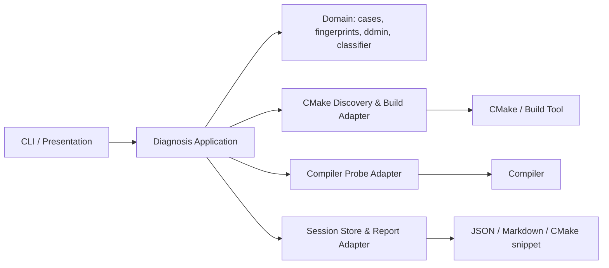
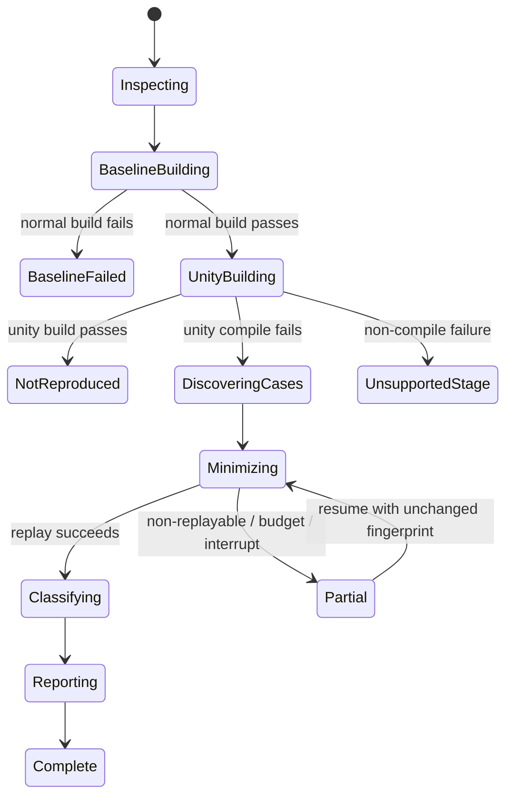
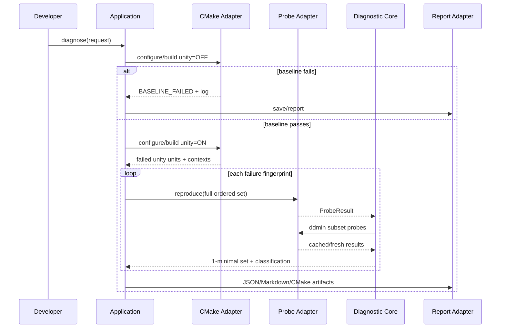

# 设计文档：Unity Build Doctor

> 阶段：design
>
> 工作流：requirements-first
>
> 设计深度：high
>
> 状态：已校验
>
> 最近更新：2026-07-29

## 设计摘要

- 目标：以只读方式证明 Unity 专属失败、定位 1-minimal 有序冲突集合、给出证据化分类和分级 CMake 缓解。
- 覆盖行为：REQ-001–REQ-007。
- 核心方案：Python 3 标准库 CLI + CMake File API/编译数据库适配器 + 命令重放探针 + 保序 delta debugging + 规则分类器 + JSON/Markdown 报告。
- 模块/构建边界：ARCH-001–ARCH-005 / BUILD-001–BUILD-003。
- 本方案是实施建议，不是当前仓库事实；实施前需确认 ASM-001。

## 代码库调查

| 证据类型 | 证据 | 已验证事实 | 对设计的影响 |
|---|---|---|---|
| 仓库 | `git status --short --branch`、`rg --files -uu` | 空仓库，无源码、构建配置、测试和提交 | 采用绿地模块边界；不能兼容不存在的现有 API |
| 结构基线 | `inspect_structure.py /Users/qingyizhu/Documents/cmake_unitybuild` | 源文件 0、构建文件 0 | 首任务必须先建立包、CLI 和夹具骨架 |
| 本机 | `cmake --version` | CMake 3.27.1 | 可验证 3.27 行为，其他版本需要 CI/夹具证据 |
| 本机 | `clang++ --version` | Apple Clang 17.0.0，arm64 macOS | 首个真实编译夹具使用 Clang；不能声称 MSVC/GCC 已验证 |
| 本机 | `command -v qmake...` | 未探测到 Qt/qmake | 核心不得依赖 Qt；Qt 分类使用静态夹具，真实 Qt 项目后补 |
| 官方文档 | CMake `UNITY_BUILD` | Unity driver 按顺序 include 原 source，BATCH/GROUP 可选 | 保序分析 Unity driver；可生成 GROUP/排除建议 |
| 官方文档 | CMake File API | build tree 可提供 versioned codemodel JSON | 项目发现优先使用公开语义接口 |

### 工具链与兼容性基线

| 项目 | 已验证值 | 证据 | 设计结论 |
|---|---|---|---|
| OS/架构 | macOS arm64 | Clang target triple | 当前唯一原生验证平台 |
| 构建系统 | CMake 3.27.1 + Ninja | 本机命令 | MVP 面向 CMake；不解析 `.pro` 作为主流程 |
| 编译器 | Apple Clang 17 | 本机命令 | 先实现 GCC/Clang 文本诊断；MSVC parser 是独立适配任务 |
| 框架 | 未探测到 Qt | PATH 探测 | Qt GUI 不进入核心；生成源识别不依赖 Qt runtime |
| 运行时 | Python 3.9.7；未安装 pytest | `python3 --version`、`python3 -m pytest --version`，2026-07-29 | 最低 Python 锁定为 3.9，测试使用标准库 `unittest` |

## 约束与设计原则

- 目标源码树是只读输入；所有会话、探针、对象与日志写入独立根目录。
- 先验证普通构建，再讨论 Unity；阶段证据不能跳过。
- 失败指纹是最小化谓词，不能只使用“命令非零”。
- source 顺序是冲突模型的一部分。
- 分析结果分为已复现、推断、未知；置信度不能代替证据。
- 建议优先选择可逆、局部的 CMake 缓解；源码改造只描述，不自动应用。
- 不把所有重定义称作 ODR：同一 Unity TU 内的局部名字冲突、头文件重复定义、宏改变声明和真正跨 TU ODR 的修复不同。

## 方案比较

| 方案 | 需求覆盖 | 优点 | 代价与风险 | 结论 |
|---|---|---|---|---|
| A. 只做静态扫描 | REQ-004/005 的一部分 | 快、不需要真实构建 | 无法证明普通构建健康，宏/生成文件/编译选项误报高，不能验证修复 | 否决为主方案，仅作为分类证据 |
| B. 失败日志 + 编译命令重放 + delta debugging | 覆盖全部 Must | 不改项目即可复现和最小化；证据可审计；适配多编译器 | 对 launcher、响应文件、生成步骤敏感，存在 non-replayable | 采用 |
| C. 在临时工作树自动改 CMake 并重复完整构建 | 覆盖全部 Must | 与真实 CMake 行为最接近 | 成本高、复制大仓库困难、容易碰用户改动和外部状态 | 作为 B 失败后的后续可选 backend，不进 MVP |
| D. 基于 Clang AST 的语义修复器 | 深化 REQ-004/005 | 分类与修复潜力高 | 编译数据库、Clang 版本和宏环境复杂，自动改写风险高 | 后续插件，不进 MVP |

### DEC-001：CLI-first，核心不依赖 Qt

- 上下文与需求：REQ-001–REQ-007、UNK-001、UNK-002。
- 决策：推荐 Python 3 标准库 CLI；domain/application 不引用 Qt，未来 GUI 通过稳定用例接口接入。
- 理由：当前没有 Qt/qmake，诊断目标可能同时包含 Qt 5/6；标准库已提供 JSON、子进程、路径、临时目录和并发原语。
- 代价：目标机需要 Python；单文件原生发布需额外打包验证。
- 被否决方案：立即使用 Qt Widgets 会把未知 Qt 主版本变成核心依赖；C++ CLI 需要额外 JSON/CLI 依赖或显著增加基础设施代码。

### DEC-002：双 build tree，不复用用户现有 build tree

- 上下文与需求：REQ-001、REQ-006、NFR-001。
- 决策：在用户给定诊断根目录下创建 `baseline/` 与 `unity/`，不修改或清理用户已有 build tree。
- 理由：保证配置可比较、避免缓存污染和破坏性 clean。
- 代价：额外磁盘和 configure 时间。
- 被否决方案：在同一 build tree 来回切换 Unity 选项会混入缓存与增量状态。

### DEC-003：以失败指纹驱动保序 delta debugging

- 上下文与需求：REQ-003、REQ-004。
- 决策：从失败 Unity driver 的有序 source 列表开始，以“编译探针产生相同失败指纹”为谓词执行 `ddmin`；输出 1-minimal，不声称最小基数。
- 理由：宏链、include 顺序和三文件交互不能靠简单 pair scan 可靠发现。
- 代价：最坏探针数较高；需要预算、缓存和恢复。
- 被否决方案：逐个 `SKIP` 是 O(n) 但可能找不到组合条件；全 pair 是 O(n²) 且漏掉三文件条件。

### DEC-004：建议生成与应用分离

- 上下文与需求：REQ-005、REQ-006、NFR-001。
- 决策：MVP 只输出 CMake 片段和人工代码建议；不提供 `--apply`。
- 理由：source property 有目录作用域，项目还可能存在未提交变更；错误自动修复比未修复更危险。
- 代价：开发者需要审查并手动应用。
- 被否决方案：直接改 `CMakeLists.txt` 无法在未知项目结构下保证插入位置和语义正确。

### DEC-005：公开 API 优先、文本解析降级

- 上下文与需求：REQ-002、NFR-003。
- 决策：target/source 发现顺序为 CMake File API → 编译数据库 → 从生成 Unity driver 与构建日志恢复；不解析 `build.ninja`/Makefile 私有结构作为 MVP 契约。
- 理由：File API 与编译数据库有官方、版本化语义。
- 代价：configure 失败或 generator 不支持编译数据库时信息可能不足。
- 被否决方案：直接解析各 generator 文件维护成本和误判风险高。

## 总体架构



### 组件与职责

| 组件 | 职责与边界 | 输入/输出 | 相关需求 |
|---|---|---|---|
| CLI | 参数校验、进度、退出码；不解析诊断 | `doctor diagnose/verify/resume` | REQ-001, REQ-006, REQ-007 |
| Diagnosis Application | 阶段编排、状态转换、预算/取消 | `DiagnosisRequest -> Session` | 全部 |
| Project Model | 配置、target、source、compile context 的规范化 | File API/compile DB -> immutable model | REQ-001, REQ-002 |
| Diagnostic Core | 失败指纹、保序 ddmin、分类规则、建议决策 | logs/probes/source excerpts -> cases | REQ-003–REQ-005 |
| CMake Adapter | configure/build/File API/Unity driver 发现 | external command results | REQ-001, REQ-002 |
| Probe Adapter | 安全重写只编译命令并运行临时 Unity driver | ordered sources + context -> ProbeResult | REQ-003 |
| Session/Report Adapter | 原子状态、缓存、隐私过滤、JSON/Markdown/CMake | session model -> artifacts | REQ-005–REQ-007 |

## 模块与依赖边界

### ARCH-001：内核不依赖进程、文件系统或展示层

- 决策：`domain` 只包含不可变模型、失败指纹、ddmin 和分类决策；通过端口接收探针结果。
- 组合根：`unity_doctor/cli.py`。
- 禁止的跨层依赖：domain 不 import subprocess/pathlib CLI renderer；adapter 不直接决定分类。
- 边界验证方法：import contract 测试 + domain 单元测试无需 CMake/编译器。

### ARCH-002：应用层拥有诊断状态机

- 决策：application 只编排用例，不拼接编译器 argv，也不渲染 Markdown。
- 组合根：CLI 构造 CMake/Probe/Session ports。
- 禁止的跨层依赖：CLI 不跳过 application 直接运行探针。
- 边界验证方法：fake adapters 的状态机测试。

### ARCH-003：外部工具差异封装在 adapter

- 决策：CMake、GCC/Clang、MSVC 命令与诊断差异分别封装。
- 禁止的跨层依赖：domain 中不得出现 `/Fo`、`-o`、Ninja 路径等语法。
- 边界验证方法：golden argv/diagnostic fixture。

### ARCH-004：报告只消费稳定 session model

- 决策：JSON 是规范数据，Markdown 和 CMake snippet 从同一模型派生。
- 禁止的跨层依赖：分类器不拼 Markdown；renderer 不读取原始源码树。
- 边界验证方法：schema + snapshot + case ID 一致性测试。

### ARCH-005：未来 UI/CI 是可替换 presentation

- 决策：Qt GUI 或 CI wrapper 只能调用 application use case 和读取版本化 JSON。
- 禁止的跨层依赖：核心不得回调 widget 或假定交互式终端。
- 边界验证方法：headless 端到端测试。

| 模块/层 | 单一主要职责 | 公开契约/数据所有权 | 允许依赖 | 禁止依赖 | 目录/测试所有权 |
|---|---|---|---|---|---|
| `domain` | 诊断模型与算法 | `FailureFingerprint`, `ConflictCase`, `ddmin` | Python stdlib value types | adapters, CLI, filesystem | `src/unity_doctor/domain`, `tests/unit/domain` |
| `application` | 用例/状态机 | `diagnose`, `resume`, `verify` ports | domain | concrete subprocess/renderers | `src/unity_doctor/application`, `tests/unit/application` |
| `adapters.cmake` | 项目发现与构建 | `ProjectDiscovery`, `BuildRunner` | domain port types, stdlib | CLI/renderer | `src/unity_doctor/adapters/cmake`, integration tests |
| `adapters.compiler` | 编译重放和诊断解析 | `ProbeRunner`, `DiagnosticParser` | domain port types, stdlib | report/CLI | `src/unity_doctor/adapters/compiler`, fixtures |
| `adapters.reporting` | 状态和工件 | `SessionStore`, renderers | domain/application DTO | subprocess | `src/unity_doctor/adapters/reporting`, schema/snapshot tests |
| `presentation` | CLI | command/exit-code contract | application + adapter composition | domain internals | `src/unity_doctor/cli.py`, CLI tests |

## 构建与交付结构

### BUILD-001：Python 包是单一 MVP 构建单元

- 已确认构建系统及版本：使用兼容 Python 3.9+ 的 `pyproject.toml` 标准 Python package；测试仅使用标准库 `unittest`，避免为开发验证引入额外依赖。
- 顶层入口仅负责：包元数据、测试/质量工具配置和 console script。
- 模块就近声明：Python 包目录表达模块边界，不在顶层脚本堆诊断逻辑。
- 可复用规则：测试夹具生成与 schema 校验放在 `tools/`/`tests/fixtures`。
- 资源、安装、签名、部署/发布：MVP 不定义安装器和签名。

### BUILD-002：测试夹具是独立 CMake 构建单元

- 每个冲突类别一个小型 CMake fixture target，普通构建必须过、Unity 构建按预期失败。
- 夹具不得依赖开发机 Qt；Qt/生成源类别先使用等价生成 `.cpp` 模型。
- 真实 Qt 5/6 集成验证作为 optional task。

### BUILD-003：目标项目构建与工具自身构建隔离

- 诊断 build tree 位于用户显式路径，至少包含 `baseline/`、`unity/`、`sessions/<id>/probes/`。
- 工具不得把自身依赖或编译参数注入目标项目。
- 所有外部命令以 argv 数组执行，不经 shell 拼接。

| 构建单元/Package | 类型 | 所有模块 | 公开依赖 | 私有依赖 | 定义位置 | 验证单元 |
|---|---|---|---|---|---|---|
| `unity-build-doctor` | Python application | 全部生产包 | Python runtime、CMake CLI | 无第三方运行时依赖（建议） | `pyproject.toml` | unit + integration + e2e |
| conflict fixtures | CMake test projects | 合成旧项目模式 | CMake/C++ compiler | 无 | `tests/fixtures/*/CMakeLists.txt` | CTest/pytest 驱动 |

## 平台与交付矩阵

- 目标平台集合及证据：仅 macOS arm64 为当前已验证候选；Windows/Linux 是设计目标但未验证。
- 开发输出根目录约定：源码运行 `python -m unity_doctor`；安装后的 console script 路径由 Python 环境决定，不在本 Spec 猜测。
- 原生构建/验证环境：当前 macOS arm64；其他平台需原生 CI runner 后才能标记支持。

| 目标平台/架构 | 开发构建物及精确路径 | 安装/部署产物 | 最终发布包 | 运行时依赖与资源 | 原生验证命令/证据 |
|---|---|---|---|---|---|
| macOS arm64 | `src/unity_doctor/` + `python -m unity_doctor` | 不适用（MVP 源码运行） | 不适用 | Python 3.9+、CMake、目标编译器 | `python -m unittest discover -s tests`; fixture e2e |
| Windows / 未知 | 未确认 | 未确认 | 未确认 | 预期 Python、CMake、MSVC；未验证 | 原生 runner 待定 |
| Linux / 未知 | 未确认 | 未确认 | 未确认 | 预期 Python、CMake、GCC/Clang；未验证 | 原生 runner 待定 |

### macOS 应用束约束

- 不适用：MVP 是 CLI，不生成 `.app`。

## 复杂度预算与演进规则

| 维度 | 当前基线 | 边界/触发条件 | 触发后动作 | 验证方式 |
|---|---|---|---|---|
| 文件职责 | 尚无代码 | 一个模块同时负责命令执行、解析和分类中的两项即触发 | 拆为 port/adapter/domain policy | review + import tests |
| 模块依赖 | 设计为单向 | domain 引用 adapter/presentation 或出现循环即触发 | 重开设计，提取稳定契约 | dependency test |
| CLI 职责 | 仅参数/展示/组合 | CLI 文件出现编译器语法或 ddmin 算法即触发 | 移入 adapter/domain | unit ownership |
| 诊断规则 | 每规则独立证据 | 单规则超过 150 行或混合两个类别即触发 | 拆分 matcher/evidence builder | fixture matrix |
| 编译器适配 | 每族一个 parser/replayer | GCC/Clang 与 MSVC 条件交错即触发 | 独立策略对象 | golden tests |
| 测试所有权 | 模块就近 | 只能用完整 e2e 验证 domain 规则即触发 | 增加纯模型单元测试 | test pyramid |

## 接口契约

| 接口/事件 | 请求或输入 | 响应或副作用 | 错误语义 | 兼容性 |
|---|---|---|---|---|
| `diagnose` | source, diagnostic_root, preset/config, targets, budget | session ID + reports | `BASELINE_FAILED`, `NOT_REPRODUCED`, `PARTIAL`, `COMPLETE` | CLI v1 |
| `ProjectDiscovery.discover` | configured build dir | immutable project/target/source contexts | evidence missing with remediation | File API v1/codemodel v2 preferred |
| `BuildRunner.build` | mode, config, targets | command records + logs | stage-specific failure, never bool-only | adapter versioned |
| `ProbeRunner.compile` | ordered sources, compile context, fingerprint | `ProbeResult` | timeout/crash/non-replayable distinct | compiler-family strategies |
| `SessionStore.save/load` | schema-versioned session | atomic JSON | corrupt/incompatible version explicit | additive schema evolution |
| `render` | complete/partial session | `.json`, `.md`, `.cmake` | report failure must not erase session | schema version in JSON |

## 数据模型与状态

- `SessionManifest`：输入路径摘要、源码版本、工具链、配置、用户参数、预算。
- `TargetContext`：target ID、创建目录、language、sources、compile groups。
- `FailureFingerprint`：compiler family、phase、primary code/category、normalized symbol/location、exit kind。
- `ConflictCase`：原 Unity source、ordered candidates、probe history、minimal set、classification、suggestions。
- `ProbeRecord`：subset hash、argv digest、cwd、timestamps、exit、fingerprint、log path。
- 路径在会话内部使用规范化绝对路径，报告默认相对 source/build root 展示。
- 会话 JSON 以临时文件 + fsync + 原子 replace 保存；单会话进程锁避免并发写。



## 关键流程



## 算法与伪代码

### 失败指纹

1. 解析外部命令阶段：configure、compile、link、codegen、test、infrastructure。
2. 对 compile 诊断选择首个 fatal/error 作为 primary；将路径转换为 root-relative，移除行列号等易变字段但保留符号。
3. 指纹包含 compiler family 和错误类别，防止“原重定义消失、另一个缺头文件错误出现”被当作复现。
4. 原始日志永不因规范化而丢弃。

### 保序 ddmin

```text
input: ordered candidates C, expected fingerprint F
require: probe(C) reproduces F
n = 2
while len(C) >= 2 and budget remains:
    partitions = contiguous_partitions(C, n)
    if any probe(partition) reproduces F:
        C = first reproducing partition
        n = max(n - 1, 2)
        continue
    if any probe(C without partition) reproduces F:
        C = first reproducing complement
        n = max(n - 1, 2)
        continue
    if n == len(C): break
    n = min(2 * n, len(C))
verify that C reproduces F
verify each C-with-one-removed does not reproduce F
return C as 1-minimal, preserving original order
```

- 每个 subset 以 source 内容摘要 + 编译上下文摘要 + 工具链摘要作为缓存键。
- 反序实验仅用于分类，不能替代原序最小化结论。
- 探针 driver 只包含绝对路径 source 的 `#include`，并在独立目录输出对象；命令重放器移除原 input/output/dependency flags 后添加探针 input/output。

### 分类优先级

1. 基础设施/单文件失败。
2. 逐文件 compile context 不一致或不可安全合并。
3. 宏定义/undef 与顺序实验。
4. 同一符号在多个 `.cpp` 定义：文件级 static、匿名命名空间、类型/枚举/函数。
5. 头文件 guard/定义证据。
6. include 顺序/缺失直接 include。
7. Qt/生成 source 模式。
8. 未知，多候选低置信度。

## 错误处理与恢复

| 失败点 | 检测 | 处理/重试 | 用户可见结果 | 恢复 |
|---|---|---|---|---|
| configure 失败 | 非零 + CMake 日志 | 不自动换生成器 | baseline/configure failed | 修复配置后新会话 |
| 普通 build 失败 | 阶段 + 日志 | 不进入 Unity | baseline failed | 修复迁移后重跑 |
| 编译数据库缺失 | 文件/能力检查 | 提供重新 configure 参数 | evidence missing | 重新 configure |
| 探针不复现 | 指纹不同 | 一次可选 verbose 重放 | non-replayable | 保留原映射，人工或后续 backend |
| 探针超时/崩溃 | timeout/signal | 按策略至多重试一次 | infrastructure failure | 增预算/修工具链 |
| Ctrl-C | 信号/取消 token | 终止子进程组、保存 | interrupted/partial | `resume <session>` |
| 状态损坏 | schema/hash 校验 | 不覆盖原文件 | corrupt session | 从备份/新会话 |

## 非功能设计

- 安全与隐私：不使用 shell；拒绝源码与 build 根重叠；报告对环境和路径做允许名单处理；源码摘录限制上下文行数。
- 性能与容量：探针结果内容寻址缓存；案件可串行保证日志清晰，未来可在互不相交案件间并行；预算是硬上限。
- 可观测性：命令记录、阶段事件、探针计数、缓存命中、耗时和最终状态进入 JSON。
- 兼容性：启动时能力探测；source property 建议使用 CMake 3.18+ `TARGET_DIRECTORY` 作用域；不支持时生成“需放在 target 创建目录”的兼容片段。
- 部署/迁移/回滚：MVP 不修改项目，回滚仅删除诊断根目录；不定义发布包。

## 正确性属性

### PROP-001：基线门禁

- 来源：REQ-001 / AC-001.2。
- 属性：对于任意普通构建失败的会话，探针调用次数始终为 0。
- 验证：状态机性质测试 + baseline-fail e2e。

### PROP-002：1-minimal 证据

- 来源：REQ-003 / AC-003.1。
- 属性：对于任意标记 `MINIMIZED` 的集合 S，`probe(S)` 复现目标指纹，且任意 `x ∈ S`，`probe(S - x)` 不复现目标指纹。
- 验证：生成式 predicate 测试 + 编译夹具。

### PROP-003：不混淆失败

- 来源：REQ-003, REQ-004。
- 属性：任意探针若只产生不同失败指纹，不得被计为目标失败的复现。
- 验证：多错误序列测试。

### PROP-004：源码树不变

- 来源：REQ-006 / NFR-001。
- 属性：对于完成、失败、超时和中断会话，目标源码树内容、权限和时间戳快照保持不变。
- 验证：端到端前后快照。

### PROP-005：报告一致性

- 来源：REQ-006 / AC-006.1。
- 属性：JSON、Markdown 和 CMake 工件引用的 session/case/fingerprint/source ID 均存在于同一规范 session model。
- 验证：schema + cross-artifact test。

### PROP-006：缓存安全

- 来源：REQ-006 / AC-006.3。
- 属性：source 内容、编译上下文或工具链摘要任一变化时，旧 probe result 不得命中新缓存键。
- 验证：参数化缓存测试。

### PROP-007：建议版本兼容

- 来源：REQ-005 / AC-005.3。
- 属性：任意生成的 CMake 属性片段，其最低版本不高于探测版本；否则必须显式标记不可用而非可复制片段。
- 验证：能力矩阵/快照测试。

## 测试策略

| 行为/属性 | 测试层级 | 关键场景 | 证据形式 |
|---|---|---|---|
| REQ-001 / PROP-001,004 | application + e2e | baseline fail/pass、路径重叠、源码快照 | unittest/CTest logs |
| REQ-002 | adapter integration | 多 target、生成 Unity driver、link/codegen fail | fixture reports |
| REQ-003 / PROP-002,003,006 | unit/property + compile integration | pair、三文件宏链、顺序、预算、non-replayable | probe matrix |
| REQ-004 | golden corpus | 9 类分类、歧义/低置信度 | expected JSON |
| REQ-005 / PROP-007 | unit/snapshot | 3.16/3.18/3.20/3.27 能力 | CMake snippets |
| REQ-006 / PROP-005 | schema/e2e | JSON/MD 一致、中断恢复、隐私 | schema validator |
| REQ-007 | e2e | 双模式、测试失败、3 次中位数 | verification report |

## 需求覆盖矩阵

| 行为 | 组件/接口 | 架构/构建边界 | 决策 | 正确性属性 | 测试策略 |
|---|---|---|---|---|---|
| REQ-001 | Application, CMake Adapter | ARCH-002,003 / BUILD-003 | DEC-002 | PROP-001,004 | baseline e2e |
| REQ-002 | Project Model, CMake Adapter | ARCH-003 / BUILD-002 | DEC-005 | PROP-003 | discovery fixtures |
| REQ-003 | Domain, Probe Adapter | ARCH-001,003 / BUILD-002 | DEC-003 | PROP-002,003,006 | property + compile |
| REQ-004 | Diagnostic Core | ARCH-001 / BUILD-002 | DEC-003 | PROP-003 | golden corpus |
| REQ-005 | Core, Report Adapter | ARCH-004 / BUILD-001 | DEC-004 | PROP-005,007 | snapshot |
| REQ-006 | Session/Report, CLI | ARCH-002,004 / BUILD-003 | DEC-002,004 | PROP-004,005,006 | schema/recovery |
| REQ-007 | Application, CMake Adapter | ARCH-002,003 / BUILD-003 | DEC-002 | PROP-004,005 | verify e2e |

## 风险与未决问题

- RISK-001：命令重放无法覆盖所有 compiler launcher、response file 和生成依赖；MVP 必须诚实降级。
- RISK-002：MSVC 诊断和命令重放尚无当前环境证据，不能在 macOS 上标记已验证。
- RISK-003：Qt AUTOMOC 真实失败需要 Qt 5/6 夹具或用户项目证据。
- [x] 设计基线采用 Python CLI；若要求 C++/Qt，重开 design 并更新 BUILD/ARCH/任务。
- [x] 平台、CMake/Qt/编译器矩阵和失败样例由 `DiagnosisRequest` 在接入真实项目时提供并记录，不作为静态默认值。

## 外部设计依据

- [CMake `UNITY_BUILD`](https://cmake.org/cmake/help/latest/prop_tgt/UNITY_BUILD.html)
- [CMake `UNITY_BUILD_MODE`](https://cmake.org/cmake/help/latest/prop_tgt/UNITY_BUILD_MODE.html)
- [CMake `UNITY_GROUP`](https://cmake.org/cmake/help/latest/prop_sf/UNITY_GROUP.html)
- [CMake `UNITY_BUILD_UNIQUE_ID`](https://cmake.org/cmake/help/latest/prop_tgt/UNITY_BUILD_UNIQUE_ID.html)
- [CMake `set_source_files_properties`](https://cmake.org/cmake/help/latest/command/set_source_files_properties.html)
- [CMake File API](https://cmake.org/cmake/help/latest/manual/cmake-file-api.7.html)
